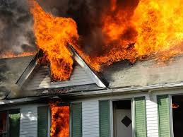
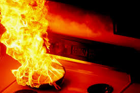
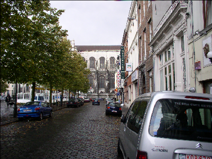
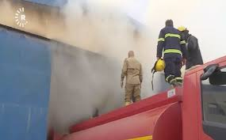
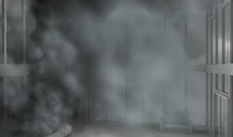

# Fire-Flame-Dataset
___
An image dataset for training fire and frame detection AI
___
<strong> Fire-Flame-Dataset </strong> is a dataset collected in order to train machine learning model to recognize Fire, smoke, and neutral(images without fire or smoke).This a dataset containing about 3000 images and 3 classes which include:
* Fire 
* Smoke
* neutral 
 

There are 1000 images in each category and 900 for train and 100 for testing

### Download, Training and Prediction
___
The Fire-Flame-Dataset is provided for download in the release section of this repository. You can download the dataset via this link [Fire-Flame-Dataset](https://github.com/DeepQuestAI/Fire-Smoke-Dataset/releases/download/v1/FIRE-SMOKE-DATASET.zip). 

The implementation code in which the model was train with has been provide in this repository. The model was trained with train with resnet50 and a accuracy of 85% on the test data was achieved. The python codebase is contained in fire_flame.ipynb. 

<strong>Some of the prediction results are shown below:</strong>  

> ('Image of:', 'Class: Fire', 'Confidence score: 1.0') 

> ('Image of:', 'Class: Fire', 'Confidence score: 0.990234375') 

> ('Image of:', 'Class: Neutral', 'Confidence score: 0.99365234375') 

> ('Image of:', 'Class: Neutral', 'Confidence score: 1.0') 

> ('Image of:', 'Class: Smoke', 'Confidence score: 0.4462890625') 

> ('Image of:', 'Class: Smoke', 'Confidence score: 0.9970703125') 

### Reqirements
___
* Python 3
* Pytorch
* Numpy
* Matplotlib
* TorchFussion

### References
___
* [Kaiming H. et al, Deep Residual Learning for Image Recognition](https://arxiv.org/abs/1512.03385 )
